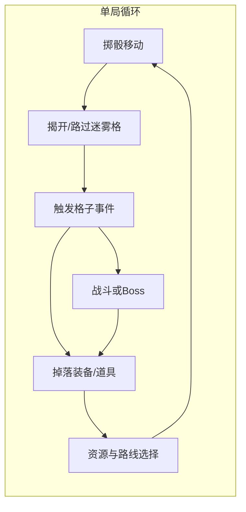

# 《黑暗之塔》游戏产品设计纲要

## 1. 产品定位与体验支柱

**一句话**：在神权统治与屠村之仇的叙事驱动下，用「大富翁式骰子 + 迷雾探索格子」爬 99 层暗塔，Roguelike 死亡重来，搭配轻量 RPG 数值成长与构筑。

建议三根体验支柱（可作为后续一切系统的取舍标准）：

- **不公与复仇的情绪张力**：教廷即规则、神明即终局；塔内规则亦残酷，但玩家通过道具与构筑「作弊」命运（多骰、定点数、看雾）。
- **每一步的惊喜与风险**：迷雾 + 骰子随机制造「信息不完整下的决策」——是否用道具改骰、是否赌未踩格子。
- **长单局深度 + 进阶重玩（类杀戮尖塔）**：**章节制**下，一次完整通关目标 **5–8 小时**（可随平衡调整）；通关后通过 **进阶等级（如 Ascension）** 抬高敌人强度、事件惩罚、资源紧缩或 Boss 机制，驱动多周目；死亡为 Roguelike 式重来，配合 **角色/卡牌或道具池解锁** 延长寿命。

**品类标签**：Roguelike 爬塔 + 轻 RPG + 棋盘式移动（非传统格栅战棋）；单局时长与难度曲线对标《杀戮尖塔》式「一长局 + 多周目进阶」，而非手游式短局。

**长单局配套（必读）**：5–8 小时需支持 **随时存档 / 继续** 或 **章节节点存盘**，避免现实打断劝退；进阶模式下可禁用部分「刷开局」漏洞或收紧休息点，与尖塔逻辑一致需在数值文档中单列。

---

## 2. 叙事与世界观（与玩法咬合）

你已有关键锚点可直接产品化：

| 叙事节点       | 可落地的玩法/系统                                                                          |
| -------------- | ------------------------------------------------------------------------------------------ |
| 神明靠信仰统治 | 「信仰值」可作为资源或诅咒：高信仰换短期 Buff 但加速「清算」事件；或与某神明契约换强力道具 |
| 教廷屠杀       | 塔内周期性出现「审判官」「火刑格子」类事件，强化情绪                                       |
| 恶魔指引       | 恶魔=规则外的力量：恶魔道具、诅咒装备、捷径楼层（风险转移）                                |
| 塔通天界       | 每若干层换主题分区（炼狱构造、伪天堂、真神庭前奏），Boss 造型与台词递进                    |

不必在第一版写全长剧本；**先锁 3 段式章节**（例如 1–33 / 34–66 / 67–99）每段换环境美术与事件池即可。

---

## 3. 核心循环（可画在 GDD 首页）

**层间节奏**：本层找 1–2 个「上楼格」→ 触发守关 Boss → 胜利后选简单奖励（生命、货币、词条）→ 进入下一层刷新地图与事件池。

---

## 4. 地图与楼层规则（细化你已有设定）

### 4.1 30 格与结构建议

纯线性 30 格易乏味，建议**隐式拓扑**仍是一条「主环或主链」，但用事件表现分叉感：

- **方案 A（推荐）**：环形跑道，若干「支路格」事件（进入子区域 1–3 步再归环），视觉上仍 30 格主循环。
- **方案 B**：30 格为节点图（少数格多出口），实现成本高但策略深。

每层 **固定 1 个上楼口 + 低概率隐藏第 2 上楼口**（需道具或任务解锁），满足你「1–2 个上楼格」又不让每层过于雷同。

### 4.2 迷雾规则（可多种难度）

- **路过可见**：走过邻格显示类型图标（安全/危险/未知），未识别具体事件。
- **站立揭晓**：踩上才知具体效果（你原文设定）。
- **道具/技能**：「层内全雾驱散（一次性）」「下一格预知」「标记可疑格」。

### 4.3 骰子与移动感

基础：**1 枚六面骰**。可扩展：

- 诅咒：强制最小/最大点、骰子「灌铅」偏向某面。
- Blessing：双骰取大/取和、重掷一次。
- **固定步数道具**：消耗品或稀有，用于精准踩上楼格或避开已知伤害格。

与大富翁的差异点：**格子效果是 Roguelike 事件表**，不是单纯买地收租；「银行/监狱」可转化为「圣狱」「什一税」主题事件。

---

## 5. 格子事件库（大量创意方向，可按稀有度分层）

下面按**功能分类**列出可调参数的事件 idea，实装时每种给权重与层数曲线（前期少即死，后期多抉择）。

**资源与成长**

- 金币/魂屑：商店、献祭、锻造。
- 经验/升级：可选三选一属性（生命、攻击、魔力、骰子重掷次数）。
- 临时 Buff：下一战斗减伤、下一骰子 +1、本层首个伤害格无效。

**移动与位置**

- 再动一次 / 减半移动 / 传送至随机已揭示格 / 传送至随机雾格（高风险）。
- 「朝圣道」：强制顺时针多走 N 格（可能绕开或撞上 Boss 格）。
- 「回头岸」：后退 3–5 格但回血（风险与回报）。

**楼层与结构**

- 隐秘楼梯：上楼口但带诅咒或迷你战。
- 竖井：下落 1–2 层，给补偿宝箱（Roguelike 经典落差）。
- 「异端藏身处」：本层第二个上楼口仅在此事件后出现。

**伤害与压力**

- 落石、圣水灼伤、精神侵蚀（扣魔力或加「暴露值」引来追猎）。
- 「告解室」：掉血换净化（移除诅咒/减暴露）。

**选择与剧情**

- 救助 NPC：下次商店折扣 vs 立即道具。
- 伪神迹：选「信」得 Buff 与后续审判事件；选「疑」得即时资源。

**社交与陷阱（单机也可做「幻象」）**

- 镜像格：复制你上一次格子效果。
- 赌徒格：赌骰单双换加倍奖励或诅咒。

**稀有「机制格」**

- 改写了局部地图：翻转伤害与安全标记一轮。
- 与时间相关：每在塔内待 X 步触发一次「肃清」（精英遭遇）。

设计时注意：**每层事件池要有「燃料」（爽点）与「刹车」（压力）**，避免出现「全是垃圾格」或「全是补给格」。

---

## 6. 道具系统扩展（在你已有基础上）

### 6.1 消耗品（跑得动、看得见的爽）

- 生命/魔法药剂（已有）。
- 前进/后退 N 格卷轴（已有）。
- 多一枚骰子（已有）——建议设**当回合仅额外一次滚动**或「双骰取优」防爆炸强度。
- 固定移动点数（已有）。
- 层雾驱散（已有）——可分级：全层 / 仅揭示类型 / 仅揭示周围一圈。
- **新增方向**：重掷骰子令、跳过事件令、「锚定格」放置后再传送回来、净化香、封印上楼口引诱 Boss 先出后再上等。

### 6.2 永久装备位（轻 RPG）

- **武器**：普攻倍率、暴击、附魔（吸血、圣焰对恶魔无效等世界观挂钩）。
- **防具**：护甲、抗性、格挡次数。
- **饰品**：改骰面权重、开局多道具、商店降价。

用 **词条稀有度 + 套装**（如「异端伪装」减教会遭遇）控制构筑深度，避免纯堆数值。

### 6.3 魔法（建议与魔力与冷却绑定）

- 伤害类、控制类（跳过敌方行动）、位移类（多走/少走）、揭示类。
- **契约魔法**：向恶魔预付生命换本层超强效果，呼应剧情。

---

## 7. Boss 与战斗（守关）

- **触发**：踏上上楼格 → Boss 战；或先战再允许上楼（二选一皆可，建议「先战后上楼」节奏更清晰）。
- **Boss 主题**：每区段换教派兵种——审判官、苦修巨像、信仰聚合体；后期「天使战」反差。
- **与棋盘联动（差异化卖点）**：例如 Boss 战每回合要你「掷点决定可用技能槽位」或「场地对应跑道格子状态」，让跑图构筑影响战斗。

若战斗系统初版要省成本：**回合制卡牌 / 自动战斗 + 玩家选技能** 选一即可，核心是 **Boss 技能与楼层 theme 一致**。

---

## 8. Roguelike、章节与难度（已定案 + 尖塔式进阶）

**已锁定方向**：

- **结构**：**章节制**（与塔 1–33 / 34–66 / 67–99 三区段天然对齐）；每章可有独立叙事收束与 Boss，整局贯通仍为一次 Run。
- **单局时长目标**：**5–8 小时** 完成「当前角色、当前难度下的一次完整通关流程」——通过层数、事件密度、战斗长度、商店与休整频率反推数值，并在测试中收敛。
- **难度与重玩**：采用 **《杀戮尖塔》式进阶**——通关后解锁更高 **进阶等级**，每层进阶叠加若干全局 Debuff 或敌方 Buff（示例：敌人伤害 +X%、更少休息格/商店、伤害格权重上升、Boss 多一段机制、起始生命降低等）；高进阶可绑定 **成就 / 皮肤 / 立绘** 或 **真结局门槛**，按需选一即可。
- **死亡**：单局内死亡 **整体重来**（Roguelike）；**Meta 解锁**（新角色、新遗物/道具进池、新事件）在局外永久保留，与尖塔一致。
- **存盘**：长单局必须 **单 Run 多存档点**（每层结束、Boss 后、或手动暂停存档），避免玩家不敢开新局。

**仍可细化（写入 GDD 时填表）**：进阶共多少档、是否每层进阶多项自选还是固定清单、是否保留「自定义挑战」模式（突变因子）。

---

## 9. 内容与生产管线（务实分期）

| 阶段      | 目标                                           |
| --------- | ---------------------------------------------- |
| 垂直切片  | 10 层、15–20 种事件、3 Boss、20 道具、基础战斗 |
| EA / 试玩 | 33 层第一章、完整 UI、meta 解锁                |
| 1.0       | 99 层三分区、完整装备词条、多结局              |

事件与道具建议用 **数据表驱动**（权重、层数区间、前置条件），方便你持续「加想法」而不狂改代码。

---

## 10. 风险与设计自检清单

- **随机性过量**：用「揭示」「重掷资源」「保底补给格」给玩家代理感。
- **找楼上楼挫败**：第二层上楼口、道具定点移动、小地图标记已揭示上楼候选格。
- **叙事与玩法脱节**：关键道具与事件取名始终带「教廷/信仰/异端/恶魔」语义，保持统一。

---

## 11. 建议你下一步交付物（非代码）

1. 1 页 **核心循环图** + **目标玩家**；单局时长已锚定 **5–8 小时** + **进阶难度表 v0**。
2. **事件表 v0**：20–30 条带权重与标签（好/坏/中性/楼层改变）。
3. **道具表 v0**：分级与叠加上限说明。
4. **第一章 33 层** 的 Boss 与区域主题清单。

若你之后希望落到具体项目（引擎、数据 schema、原型），可以把目标平台与团队规模说一下，再把同一套设计拆成技术里程碑。
